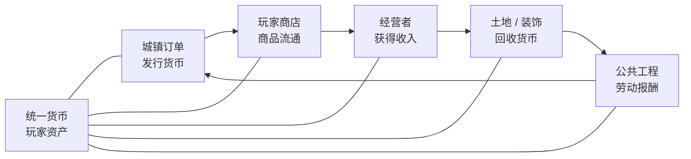

<!-- 与同目录 Word 策划书同步；SERVER_PLAN.md 为同内容入口。 -->

# 食韵筑家III：烟火长歌 - 服务器总体策划书

> 长线生活 · 美食经营 · 聚落共建
>
> Minecraft 1.21.1 / NeoForge 21.1.242 · 文档版本 v1.0 · 2026年8月3日

## 策划书说明

> **项目愿景**
>
> 让玩家不是为了填满数值条而上线，而是通过料理、职业、经营与公共建设，逐步把一个世界变成真正有历史、有分工、有烟火气的共同家园。

| **项目项**   | **当前定义**                              |
|--------------|-------------------------------------------|
| 服务器名称   | 食韵筑家                                  |
| 当前周目     | 食韵筑家III：烟火长歌                     |
| 游戏与加载器 | Minecraft 1.21.1 / NeoForge 21.1.242      |
| 策划阶段     | 框架搭建、系统整合与封测准备              |
| 当前模组规模 | 66 个直接安装 Mod（不含 Jar-in-Jar 依赖） |
| 玩家交流群   | 903730159                                 |
| 文档版本     | v1.0 · 2026年8月3日                       |

## 使用范围

本策划书用于统一服务器定位、玩法结构、经济规则、职业分工、公共工程、模组职责和封测标准。它既是管理组的执行依据，也是后续制作任务、数据包、配置和玩家指南时的上层设计文档。

## 内容导航

| **章节** | **主题**     | **关注重点**                 |
|----------|--------------|------------------------------|
| 01       | 项目定位     | 愿景、玩家体验与设计边界     |
| 02       | 核心玩法循环 | 分钟、单次、每周和季度节奏   |
| 03       | 美食与餐馆   | 多厨房联动、套餐、订单与饮品 |
| 04       | 职业系统     | 软职业、成长、加成与防滥用   |
| 05       | 经济系统     | 统一货币、系统订单与玩家市场 |
| 06       | 城建委托     | 蓝图、材料、验收和工程报酬   |
| 07       | 世界与生活   | 永久世界、季节、交通与探索   |
| 08       | 社区运营     | 活动节奏、引导与管理工具     |
| 09       | 模组架构     | 当前框架、重叠系统和风险项   |
| 10       | 实施与验收   | 分期计划、指标与封测清单     |

## 执行摘要

「烟火长歌」以美食经营和聚落共建为主轴。料理不只是恢复饥饿值，而是进入餐馆订单、职业成长、玩家交易和节庆活动；建筑不只是私人作品，而是通过城镇蓝图和工程委托成为永久公共资产。系统订单有限度发行货币，玩家商店承担主要流通，土地、交通、装饰和执照负责回收货币。

| **关键问题** | **策划结论** |
|----|----|
| 是否加入口渴值 | 首发不加入硬性口渴；饮品通过套餐、店铺和正向增益获得价值。 |
| 系统是否收购原料 | 不设永久无限原料收购；80%订单面向菜品与套餐，20%用于临时调控。 |
| 职业是否限制玩法 | 采用软职业；基础内容人人可用，职业提供效率、品质、委托和荣誉加成。 |
| 建筑玩家如何赚钱 | 通过「城建委托」承包蓝图工程，材料分阶段发放，验收后支付人工费。 |
| 多料理模组如何联动 | 统一原料标签与料理分类，Create做前置加工，农夫乐事做基础，万花筒做特色。 |
| 长线成长靠什么 | 土地、店铺、菜谱、职业、声望、公共工程和社区历史，而非战斗数值膨胀。 |

# 01 项目定位

*从“养老”出发，但不等于缺少目标；慢节奏需要持续可见的世界变化。*

> **一句话定位**
>
> 一个不轻易重置主世界，由玩家长期经营农场、餐馆、商店和聚落，并共同完成公共建筑的慢节奏生活服务器。

## 1.1 四项体验支柱

| **支柱** | **玩家感受** | **主要系统** |
|----|----|----|
| 养老 | 不强迫每日上线，离开一段时间后仍能继续原来的生活。 | 周常而非日常、纯视觉季节、永久世界 |
| 美食 | 料理有菜单、订单、餐馆、节庆与地方文化价值。 | 农夫乐事、万花筒烹饪、OrderToCook |
| 建筑 | 私人住宅与公共工程都是长期成果。 | Structure Crafter、OpenPAC、家具模组 |
| 社区 | 职业互相依赖，交易与共建形成真实联系。 | JobsPlus、货币、商店、Paradigm |

## 1.2 目标玩家

- 喜欢种田、烹饪、室内设计、聚落规划和慢节奏生存的玩家。
- 上线时间不固定，但希望自己的成果可以长期保留的玩家。
- 愿意经营店铺、接受委托、提供服务或参与社区活动的玩家。
- 喜欢探索风景和收集内容，但不追求高压战斗排行的玩家。

## 1.3 明确不做

- 不以装备强化、随机词条、抽卡或伤害排行榜作为核心成长。
- 不通过大量Boss、重魔法或重工业系统改变生活服重心。
- 不设置永久无限收购圆石、木头、铁和普通农作物的提款机。
- 不通过频繁清档制造更新感；新内容优先进入新区、季度活动或新设施。
- 不让每日签到、连续登录和短期活动惩罚低频玩家。

## 1.4 成功标准

| **维度** | **观察指标** |
|----|----|
| 世界沉淀 | 主城和聚落持续出现可识别的餐馆、农场、道路和公共设施。 |
| 职业分工 | 至少四种职业在市场中持续提供商品或服务，而非所有人完全自给。 |
| 经济健康 | 玩家交易占主要流通，单一物品不长期占据系统总支出的25%以上。 |
| 玩家节奏 | 低频玩家回归后不因季节、每日任务或装备差距失去参与机会。 |
| 运营可持续 | 每月新增内容可以复用订单、节庆、工程和店铺框架，而非依赖继续堆Mod。 |

# 02 核心玩法循环

*把生产、经营和建设连接成同一个闭环，让每次劳动都能改变城镇。*

*图1 食韵筑家的长期核心循环*

## 2.1 四层节奏

| **时间尺度** | **主要行为** | **设计目的** |
|----|----|----|
| 10-30分钟 | 做一批料理、补充货架、修一段建筑、处理一次订单。 | 任何一次上线都能取得小进展。 |
| 单次游玩 | 接单、采购、生产、交付、获得收入，再投资店铺或工程。 | 形成清晰完整的短循环。 |
| 每周 | 轮换城镇订单、职业委托、市场活动和公共工程。 | 提供方向但不制造每日压力。 |
| 季度 | 节庆、城区开放、资源边界扩张和大型地标项目。 | 形成服务器共同记忆与阶段高潮。 |

## 2.2 横向成长

成长的核心不是持续增加攻击力，而是获得更多经营和创造空间：

- 更大的住宅、农场、牧场和商铺土地额度。
- 餐馆、旅店、茶馆、面包店、花店等经营资格。
- 新的菜谱、厨房设备、家具、招牌、称号与纪念品。
- 高级职业委托、公共工程提案和设计投票资格。
- 地区交通节点、市场摊位、仓储空间和物流便利。

## 2.3 三条互相咬合的游玩线

| **游玩线** | **起点**   | **中期目标**               | **长期结果**             |
|------------|------------|----------------------------|--------------------------|
| 美食经营   | 采集与做饭 | 菜单、餐馆、订单、地方名菜 | 形成餐饮品牌与节庆文化   |
| 职业经济   | 选择专业   | 技能、委托、供货与玩家服务 | 稳定职业分工和市场网络   |
| 聚落建设   | 住宅与小店 | 公共工程、市场、驿站和城区 | 留下可参观的永久世界成果 |

> **核心判断**
>
> 做饭不是终点，赚钱也不是终点。料理和货币最终都要转化为店铺、公共设施、社区声望与玩家共同完成的世界历史。

# 03 美食、厨房与餐馆

*从多套料理模组出发，建立统一原料、分工厨房、套餐订单和餐饮经营。*

## 3.1 厨房系统分工

*图2 多料理模组的推荐生产链*

| **系统** | **职责** | **不承担的内容** |
|----|----|----|
| Farmer’s Delight | 基础作物、刀具切配、汤、米饭、面团和家庭料理。 | 不独占高级地方菜。 |
| Kaleidoscope Cookery | 蒸制、炖煮、面点、地方菜和宴席料理。 | 不重复所有基础生存食物。 |
| Create | 谷物研磨、混合、压榨、分拣、运输和展示型生产线。 | 不自动完成全部高级料理与宴席。 |
| OrderToCook | 餐馆菜单、顾客、普通/加急/配送订单和经营成长。 | 不单独发行第二套长期货币。 |
| Lightman’s Currency | 餐馆和市场的统一结算货币与安全交易。 | 不承担菜谱和料理评价。 |

## 3.2 食韵料理兼容包

两套料理模组已经共享部分通用食材标签，万花筒烹饪也识别农夫乐事的刀具和热源。服务器仍需要一层自有数据包，将兼容关系从“能用”提升到“有完整设计”。

- 统一番茄、稻米、面粉、面团、肉类、鸡蛋、油和刀具标签。
- 对功能完全相同的重复原料确定唯一主来源；有特色的重复原料改造成不同品种。
- 建立主食、肉菜、素菜、汤、甜点、饮品、便当、宴席和地方特色等统一料理分类。
- 补充Create前置加工配方，但保留最终烹饪与装盘的人工环节。
- 删除成本异常、产出异常或能够形成无限循环的重复配方。
- 为系统订单提供跨模组套餐判定，不再按单个Mod分别发布订单。

## 3.3 从菜品到菜单

| **菜单类型** | **组成示例**                    | **适用场景**             |
|--------------|---------------------------------|--------------------------|
| 乡村早餐     | 面包/粥 + 蛋类 + 奶制品/热饮    | 旅店、日常顾客、新手订单 |
| 工人午餐     | 主食 + 肉菜 + 素菜 + 饮品       | 公共工程、食堂订单       |
| 旅行便当     | 耐储存主食 + 小吃 + 饮品 + 甜点 | 配送、探索和商队         |
| 茶楼套餐     | 面点 + 小菜 + 茶饮 + 水果拼盘   | 中式餐馆与节庆活动       |
| 城镇宴席     | 多种主菜 + 汤 + 甜点 + 饮品     | 节日、地标落成和全服目标 |

系统订单优先收购“订单交付箱”或完整套餐，而不是长期高价收购单一道菜。这样可以同时消耗多类食材，并降低单一自动化产线垄断收益的风险。

## 3.4 餐馆成长

| **经营阶段** | **要求**                     | **解锁**                     |
|--------------|------------------------------|------------------------------|
| 家庭厨房     | 完成基础菜谱并设置小型菜单   | 普通顾客与新手订单           |
| 街边食肆     | 稳定供货、完成若干不同套餐   | 正式摊位和配送订单           |
| 正式餐馆     | 具备店面、厨房、用餐区和仓库 | 餐馆执照、更多菜单位         |
| 地方名店     | 持续获得评价并完成主题订单   | 高级顾客、分店或驿站餐厅     |
| 食韵名店     | 举办宴席并留下代表菜         | 专属称号、署名料理与纪念装饰 |

## 3.5 饮品与口渴值

> **首发决策：不加入强制口渴值**
>
> 硬性口渴会打断建筑和探索，却不能增加长期目标。饮品通过套餐搭配、茶馆/咖啡馆经营、短时生活增益、节庆需求和图鉴收集获得价值。

- 早餐搭配牛奶或咖啡，正餐搭配茶或果汁，旅行便当搭配便携饮品。
- 增益优先面向采集、建造、旅行和饱食延长，不提供明显战斗优势。
- 如果封测后饮品仍缺少需求，再测试下降缓慢、归零不致死的软口渴系统。

# 04 职业系统

*职业创造协作与身份，不制造无法跨越的配方壁垒。*

> **职业原则**
>
> 人人都能完成基础生存内容；职业玩家在效率、品质、委托、经营许可和社区荣誉上更专业。

## 4.1 职业结构

| **项目** | **推荐规则** |
|----|----|
| 职业数量 | 首发1个主职业；服务器稳定后开放1个副职业。JobsPlus最大职业数建议锁定为2。 |
| 转职 | 7-14天冷却；保留历史等级，但只有当前激活职业提供完整加成。 |
| 等级 | 学徒、熟练、大师三级展示层，可映射到JobsPlus实际等级。 |
| 经验来源 | 多样化委托、真实交易、公共工程与阶段成就；不鼓励重复制作刷经验。 |
| 加成幅度 | 常规效率或额外产出控制在5%-15%，稀有资源不使用直接倍率。 |
| 关键内容 | 基础配方不独占；高级订单、署名、专业设施和土地资格可以职业限定。 |

## 4.2 首发职业设计

| **职业** | **核心工作** | **推荐加成** | **长期身份** |
|----|----|----|----|
| 厨师 | 料理、菜单、宴席、餐馆订单 | 精制料理概率、菜单评价、专业订单 | 地方名厨、食韵名店 |
| 农夫 | 作物、种子、温室和餐馆供货 | 种子返还、优选农产品、农业委托 | 庄园主、合作农场 |
| 牧场主 | 肉奶蛋、育种和公共牧场 | 优质畜产品、饲料效率、畜牧订单 | 牧场品牌、马厩经营 |
| 矿工 | 矿物、石材和工程材料 | 矿物样本、基础材料效率、矿业合同 | 矿区管理、工程供应商 |
| 建筑师 | 住宅委托、公共工程和景观 | 蓝图资格、工程奖金、土地权限 | 署名建筑、地标设计者 |
| 探索者 | 群系调查、商队、稀有食材 | 探索委托、地区地图、特产发现 | 地方志、路线开拓者 |
| 商人（二期） | 采购、批发、市场与拍卖 | 货架额度、摊位资格、交易信誉 | 市场经营者、商会成员 |

## 4.3 JobsPlus落地建议

当前JobsPlus默认职业包含建筑师、挖掘者、农夫、渔夫、猎人、伐木工、矿工、铁匠等，但不包含完整的厨师与牧场主。建议保留与服务器主题相符的默认职业，并通过其数据驱动能力补充自定义职业。

- 将免费职业数和最大职业数统一为2，避免无限兼职削弱市场分工。
- 关闭或弱化JobsPlus自带金币奖励，避免形成与Lightman’s Currency并行的货币。
- 厨师经验来自完成不同料理、餐馆订单和宴席，不来自反复合成同一道菜。
- 建筑师经验来自蓝图工程节点和验收，不来自随意放置再破坏方块。
- Item Restrictions只用于高级工具、专业设施或执照，不限制基础生存物品。

## 4.4 优质产品

品质只保留“普通”和“优质”两档，避免五级品质造成无法堆叠和定价混乱。优质产品主要影响高级订单、餐馆评级、收藏和署名，不显著提升战斗能力。

| **职业** | **优质产物示例**       | **主要用途**         |
|----------|------------------------|----------------------|
| 厨师     | 精制料理、署名宴席     | 高阶菜单、节庆比赛   |
| 农夫     | 优选作物、种子样本     | 名店采购、农业图鉴   |
| 牧场主   | 优质奶蛋、育种记录     | 高级早餐、牧场订单   |
| 矿工     | 矿物样本               | 矿业委托、博物展示   |
| 建筑师   | 验收为“优秀”的公共工程 | 奖金、署名、提案资格 |

## 4.5 防滥用

- 自动化产线不无限提供职业经验，职业经验设置每日或每类行为递减。
- 转职有冷却，防止制作前临时切换职业吃加成。
- 矿石、稀有战利品和高价值货币不使用直接翻倍。
- 职业加成不让某个玩家成为服务器必需在线的单点故障。
- 专业订单按个人或队伍限次，不能通过退队、重登录或转职重复领取。

# 05 经济系统

*让系统负责启动，让玩家负责流通，让建设和审美负责消耗。*

*图3 统一货币下的经济闭环*

## 5.1 统一货币决策

> **推荐方案**
>
> 以Lightman’s Currency作为唯一通用货币。OrderToCook、职业升级、悬赏和系统商店不得长期发行彼此独立的第二、第三套可消费货币。

| **系统** | **推荐职责** | **处理重叠** |
|----|----|----|
| Lightman’s Currency | 统一硬币、钱包、银行、安全商店和拍卖。 | 作为唯一通用货币标准。 |
| OrderToCook | 生成餐馆顾客、料理、配送和加急订单。 | 奖励改为Lightman硬币或统一兑换凭证。 |
| JobsPlus | 职业经验、等级与能力树。 | 自带金币不作为市场货币，建议奖励设为0或仅作技能点。 |
| Spudacious Shops | 保留视觉或特定店型优势。 | 若与Lightman商店功能重复，封测后只留一套主要玩家商店。 |
| Bountiful / LC Bounties | 城镇委托、悬赏和公共项目发布。 | 明确一主一辅或只保留一套，避免重复任务与重复发钱。 |

## 5.2 货币来源

| **来源**       | **占比方向** | **限制方式**                         |
|----------------|--------------|--------------------------------------|
| 料理与套餐订单 | 主要         | 轮换菜系、个人/队伍周上限、组合交付  |
| 公共工程       | 重要         | 蓝图验收、分阶段施工、项目总预算     |
| 新手与里程碑   | 少量         | 一次性领取                           |
| 节庆与社区活动 | 阶段性       | 按贡献和完成目标发放                 |
| 临时原料采购   | 调控性       | 短期开启、限量、低于玩家市场长期利润 |

## 5.3 原料收购规则

> **80 / 20 / 0 原则**
>
> 约80%的系统订单面向料理、套餐和服务；约20%用于节庆、开服扶持或供需失衡时的临时原料采购；永久无限原料收购为0。

原料应主要由农夫、牧场主、矿工和探索者卖给厨师、建筑师与店主。系统只提供保底方向，不能成为价格最高、需求无限的最终买家。

## 5.4 玩家市场

- 农夫和牧场主向餐馆供货，厨师通过加工和品牌获得利润。
- 矿工向Create玩家与公共工程供应基础材料，稀有矿物避免系统保底高价。
- 建筑师通过施工费和设计费赚钱，而不是靠倒卖系统发放的工程材料。
- 探索者出售地区特产、收藏品、商队物品和路线服务。
- 玩家交易目标占经济活动的60%-80%，系统订单主要负责货币投放与最低收入。

## 5.5 货币回收

| **回收项**         | **性质** | **设计注意**                               |
|--------------------|----------|--------------------------------------------|
| 土地扩建           | 长期目标 | 按用途和城区逐级开放，不形成永久租金压力。 |
| 市场摊位与店铺执照 | 经营成本 | 低额、可预测，避免低频店主一回归就破产。   |
| Waystone交通       | 便利成本 | 主城低成本，远程和私人节点承担更多费用。   |
| 装饰、称号、纪念品 | 审美消费 | 高频更新但不影响战力。                     |
| 公共工程捐赠       | 社区消费 | 显示贡献者并留下永久成果。                 |
| 拍卖与上架费       | 交易摩擦 | 比例要低，防止玩家绕开市场。               |

## 5.6 定价原则

订单价格以原料市场成本为基准，再加入加工步骤、稀有度、配送和菜单多样性补贴。系统价格应提供保底利润，但通常低于玩家餐馆对终端顾客的合理售价。

| **订单示例** | **内容**                     | **奖励逻辑**             |
|--------------|------------------------------|--------------------------|
| 工人午餐     | 主食、肉菜、素菜、饮品各16份 | 基础成本 + 多样性补贴    |
| 旅店早餐     | 面包、蛋类、奶制品、甜点     | 稳定低门槛，个人周限1次  |
| 长途配送     | 旅行便当与饮品               | 基础报酬 × 距离系数      |
| 城镇宴席     | 多种主菜、汤、甜点与饮品     | 高额项目预算，按队伍完成 |

# 06 食韵筑家·城建委托

*让建筑职业拥有稳定收入，让每一笔公共预算都变成世界里看得见的成果。*

## 6.1 标准流程

1. 城镇发布项目：明确位置、蓝图、功能、材料预算、工期和报酬。
2. 玩家或队伍承包：确定负责人、成员与分成比例。
3. 划定施工区：OpenPAC授予临时权限，公共区保持保护。
4. 分阶段发料：先地基，再主体，最后装饰；不得一次发完。
5. 节点验收：检查尺寸、功能、风格、安全和剩余材料。
6. 正式交付：移除施工权限，建筑转为公共资产。
7. 支付工程款：发放货币、建筑声望、署名和后续提案资格。

## 6.2 蓝图类型

| **类型** | **适用项目** | **自由度** | **推荐占比** |
|----|----|----|----|
| 标准工程 | 道路、桥梁、路灯、驿站、仓库 | 按蓝图尺寸与结构施工 | 40% |
| 半开放工程 | 餐馆、市场、温室、码头、公共厨房 | 规定占地、功能和色系，细节自定 | 40% |
| 创意工程 | 广场、雕像、花园、城门和纪念馆 | 投稿、投票后承建 | 20% |

## 6.3 Structure Crafter落地

当前Structure Crafter配置允许管理员审核上传，单结构尺寸上限为30×60×30，体积上限100,000。适合标准化桥梁、驿站、市场模块和公共设施；更大的地标应拆分为多个结构段或采用半开放施工。

- 蓝图由管理组审核后发布，玩家不能随意上传公共工程模板。
- 公共蓝图用于参照和验收，不鼓励使用全自动放置取代建筑劳动。
- 大型项目拆分为地基、主体、屋顶和景观四个可验收模块。
- GriefLogger记录材料领取、破坏和关键容器操作，解决争议。

## 6.4 材料与工程款

| **阶段**   | **材料比例** | **验收点**             |
|------------|--------------|------------------------|
| 承包与地基 | 约20%        | 位置、尺寸、地形整理   |
| 主体结构   | 约40%        | 承重轮廓、楼层、通行   |
| 屋顶与功能 | 约25%        | 照明、门窗、功能空间   |
| 装饰与景观 | 约15%        | 细节、周边、标识、清场 |

系统提供材料，工程款支付设计、施工、管理和协调劳动。允许3%-5%的合理损耗；剩余材料退回工程仓库。玩家自购材料只有在事先批准的变更单中才可报销。

## 6.5 工程分级与报酬

| **规模** | **示例**                   | **报酬定位**                 |
|----------|----------------------------|------------------------------|
| 小型     | 摊位、路灯、小桥、告示点   | 新手建筑师、短期项目         |
| 中型     | 餐馆、驿站、温室、道路段   | 稳定工程收入                 |
| 大型     | 市场、码头、公共厨房、车站 | 队伍承包、阶段付款           |
| 地标     | 城门、节庆广场、纪念馆     | 设计征集、单独预算与永久署名 |

## 6.6 美食与城建联动

> **示例：中央市场扩建**
>
> 全服累计提交500份工人午餐后解锁市场扩建。矿工供应石材，建筑师承建，完工后开放新摊位，农夫与厨师获得新的销售空间，进一步扩大料理需求。

## 6.7 防滥用

- 同一玩家同时最多承包一个大型工程。
- 连续14天无施工且未请假才视为停工，符合养老服节奏。
- 禁止把私人住宅包装成公共项目领取材料和资金。
- 工程材料不能出售、抵押或转移至私人领地。
- 项目验收后立即切换为公共保护，仅保留维护权限。

# 07 世界、季节与生活空间

*永久世界需要谨慎锁定生成框架，也需要持续扩展可生活、可经营的空间。*

## 7.1 主世界策略

- 正式主世界原则上永久保留，不以清档作为更新手段。
- Terralith + Tectonic + Lithostitched作为世界级核心依赖，正式开图后不随意移除。
- 首发边界建议半径6,000格，后续按季度扩张并配合交通节点。
- 出生点附近规划主城与公共市场，外围允许玩家形成不同风格的聚落。
- 重要玩家作品可以登记为历史建筑，获得长期保护和地图标识。

## 7.2 季节系统

Ecliptic Seasons 已完成配置，当前只提供季节景观，不影响作物、温度、生物、天气或其他生存数值。后期可在此边界内加入季节限定物品交易，以市场轮换和收藏目标体现季节价值。

| **季节价值** | **推荐做法** | **避免事项** |
|----|----|----|
| 视觉氛围 | 当前已启用：季节色彩与景观表现 | 重新开启作物、温度、生物或天气机制 |
| 农业与生存 | 保持完全不受季节影响 | 季节锁种、严寒酷暑或强制生存数值 |
| 限定物品（后期） | 季节轮换装饰、纪念品和地区特产 | 不得成为毕业或功能必需品 |
| 市场节奏（后期） | 按季轮换，次年复刻或开放旧季兑换 | 不做永久绝版，避免囤积炒价 |

## 7.3 聚落与交通

- Waystone作为后期聚落交通网络，主城节点低成本，私人和远程节点承担建设费用。
- 道路、桥梁、驿站、港口与市场均可进入城建委托。
- 交通便利应促进跨地区交易，但不能让探索和运输职业完全失去意义。
- 长途料理配送可以结合Waystone未覆盖区域，形成探索者和商人的服务空间。

## 7.4 建筑与家具

Handcrafted、Immersive Furniture和Structure Crafter已形成首批建筑生活组件。新增装饰模组时以“能否形成店铺、家庭和公共空间”为判断标准，不以方块数量为目标。

## 7.5 探索与支线内容

| **内容** | **定位** | **控制原则** |
|----|----|----|
| Collector’s Caravan | 稀有食材、收藏品与流动商队 | 作为探索与节庆供给，不无限出售核心资源 |
| Longwings / Spawn | 生物观察、收集与生态感 | 控制实体密度，不制造强制刷怪场 |
| Field Guide | 世界、职业、菜谱与规则引导 | 作为新手指南入口 |
| Scorched Guns | 可选冒险与收藏支线 | 不成为核心战力成长；用Item Restrictions控制高阶装备 |
| InControl | 生物生成与生态调节 | 用于保护生活区和控制特殊事件 |

## 7.6 资源世界

资源世界列为二期。在找到并验证可靠的1.21.1维度管理与重置方案前，不对正式服承诺自动重置。首发通过边界扩张、外围采集区、矿工职业和材料回收缓解资源压力。

# 08 社区运营与活动节奏

*运营不是不断加Mod，而是用既有系统持续产生新的订单、工程和故事。*

## 8.1 每周运营模板

| **内容**     | **数量建议**             | **示例**                     |
|--------------|--------------------------|------------------------------|
| 普通料理订单 | 3-5个                    | 早餐、午餐、便当、饮品       |
| 职业委托     | 2-3个                    | 农场供货、矿业材料、建筑修缮 |
| 公共工程     | 1个小型或持续推进1个大型 | 道路、市场、驿站             |
| 市场主题     | 1个                      | 海鲜周、面包周、茶饮周       |
| 社区公告     | 1次整合发布              | Paradigm公告汇总，不频繁刷屏 |

## 8.2 季度活动

- 春日茶会：茶饮、点心、花园和茶馆建筑。
- 夏夜市集：饮品、烧烤、流动摊位与夜间照明工程。
- 丰收节：全服食材目标、粮仓工程和地方名菜评选。
- 冬季团圆宴：多职业供货、宴席、广场装饰和纪念物。
- 地标落成礼：公共工程交付、建设者署名和限定菜单。

## 8.3 新手引导

1. 通过Field Guide说明服务器定位、职业、经济和领地规则。
2. 使用Not Enough Recipe Book和物品描述帮助玩家理解配方与用途。
3. 完成第一间住宅、第一次订单、第一次玩家交易和第一次公共贡献。
4. 引导玩家选择职业，但允许先体验后决定，不在出生时强制锁定。
5. 新手奖励只提供启动资金、基础工具和少量交通支持，不发放高级机器。

## 8.4 管理与社区安全

| **系统**                | **职责**                                       |
|-------------------------|------------------------------------------------|
| Paradigm                | 公告、聊天、命令、权限组、计划重启与运营信息。 |
| Open Parties and Claims | 玩家领地、队伍协作、公共区和施工权限。         |
| GriefLogger             | 破坏、容器和工程材料争议的审计依据。           |
| No Chat Reports         | 聊天签名与举报机制调整；需要客户端同步说明。   |
| Item Restrictions       | 高级武器、专业设施和职业执照的软限制。         |

## 8.5 玩家荣誉

长期服需要记录贡献而不只记录财富。建议建立餐馆名录、职业大师名录、公共工程铭牌、节庆纪念册和历史建筑档案。荣誉可以解锁提案权、署名、装饰与称号，但不直接转化为战斗优势。

# 09 模组架构与风险控制

*当前框架已覆盖生活、职业、经济、蓝图和运营，下一步重点是整合而非继续堆叠。*

> **当前状态**
>
> 截至2026年8月3日，服务端 mods 目录包含 66 个直接安装的 Jar。策划书按当前实际文件整理，旧的 19/29/50 模组基线仅作为历史记录。

## 9.1 功能架构

| **层级** | **核心组件** | **职责** |
|----|----|----|
| 内容层 | Farmer’s Delight、Kaleidoscope、Create、家具、季节、生物 | 提供可生产、可经营、可建造的内容 |
| 玩法层 | OrderToCook、JobsPlus、Structure Crafter、Bountiful | 把内容组织成订单、职业和工程 |
| 经济层 | Lightman’s Currency、Spudacious Shops、LC Bounties | 货币、商店、奖励与回收 |
| 社区层 | OpenPAC、Paradigm、GriefLogger、Field Guide | 领地、权限、公告、审计与引导 |
| 技术层 | ModernFix、Lithium、FerriteCore、ServerCore、C2ME、ScalableLux、spark | 性能、诊断和世界运行 |
| 兼容与引导层 | KubeJS、Almost Unified、Kaleidoscope Compat、JEI、Jade / Jade Addons | 统一配方与标签，处理料理模组联动，并向玩家展示用途和来源 |

## 9.2 需要优先解决的重叠

| **重叠项** | **当前涉及** | **决策方向** | **风险** |
|----|----|----|----|
| 货币 | Lightman、OrderToCook金币、JobsPlus金币 | Lightman作为唯一流通货币 | 多币种造成定价与投放失控 |
| 玩家商店 | Lightman商店、Spudacious Shops | 封测比较后确定主系统 | 重复货架、权限和定价 |
| 悬赏/委托 | Bountiful、LC Bounties、料理订单 | 按料理、职业、公共工程分工或精简 | 任务重复发奖 |
| 性能优化 | C2ME、ScalableLux、ServerCore、Lithium、ModernFix | 固定基线、逐项压力测试 | 线程与区块兼容问题 |
| 世界变化 | Terralith、Tectonic、生物控制、纯视觉季节 | 世界生成正式开图前锁定；季节保持视觉配置 | 旧新区块断层，或季节玩法机制误开启 |

## 9.3 重点风险

- C2ME当前为alpha版本，且与光照、世界生成和多个性能模组共同改写关键路径，必须做72小时多人探索测试。
- 料理订单若直接按饱食度或单品价值发钱，可能被低成本高饱食配方垄断。
- JobsPlus默认最大职业数无限，会削弱职业分工，需要在正式服前限制。
- 季节系统目前仅用于视觉。后期限定交易若采用永久绝版或涉及核心功能物品，会惩罚低频玩家，应安排周期复刻、旧季兑换和合理的购买限额。
- 枪械与高强度冒险内容可能改变服务器重心，应作为受限支线而非核心成长。
- 结构蓝图和Create自动化若完全替代玩家劳动，会削弱建筑师与厨师职业价值。

## 9.4 后续新增原则

- 新增Mod必须填补明确玩法空缺，不以“看起来不错”作为唯一理由。
- 每批新增后完成启动、进服、保存、重启、旧世界载入和权限测试。
- 优先制作食韵兼容数据包、职业配置、订单池和公共蓝图，而非继续增加料理数量。
- 正式服不自动升级Mod；所有升级先在副本环境运行至少24小时。

# 10 实施路线与封测验收

*先统一货币和数据，再搭建玩法闭环，最后才进入正式世界。*

## 10.1 分阶段实施

| **阶段** | **主要工作** | **交付物** |
|----|----|----|
| P0 基线与安全 | 锁定 66 个 Mod、配置归档、自动备份、恢复演练 | Baseline-03、备份手册 |
| P1 经济统一 | 确定Lightman货币、料理订单奖励、商店与悬赏分工 | 统一货币表、首批订单池 |
| P2 职业与料理 | 限制职业数、补厨师/牧场主、统一食材标签与套餐 | 职业配置、料理兼容包 |
| P3 城建委托 | 蓝图库、材料表、施工领地、验收与工程款 | 首批5个公共工程 |
| P4 封测 | 5-10人、72小时、多职业与分散探索 | 问题清单、平衡报告 |
| P5 正式世界 | 种子、边界、主城、客户端包、规则发布 | 首发版本与回滚包 |

## 10.2 首发最小可玩闭环

1. 每周料理与套餐订单能够使用统一货币结算。
2. 玩家可以通过商店采购原料、出售料理和提供服务。
3. 职业能够提供温和而可感知的加成，不锁死基础玩法。
4. 至少一个公共工程可以从发布、领料、施工到验收完整跑通。
5. 土地、交通、装饰或执照至少有两项稳定回收货币。

## 10.3 封测验收清单

- [ ] 服务端连续运行72小时，无崩溃、回档或区块损坏。
- [ ] 5-10名玩家分散探索时没有持续区块卡顿。
- [ ] C2ME、ScalableLux与世界生成组合在保存、重启后正常。
- [ ] OpenPAC正确保护箱子、门、动物、红石、爆炸和Create机械。
- [ ] 料理订单不会被单一低成本菜品长期垄断。
- [ ] OrderToCook、JobsPlus、商店和悬赏没有重复发行不同货币。
- [ ] 职业经验不能通过自动化、放置/破坏循环或重复登录刷取。
- [ ] 公共工程材料无法挪用，验收后权限可以顺利移交。
- [ ] 货币不能通过合成、兑换、退款或商店循环复制。
- [ ] Waystone、拍卖、钱包、厨具和商店容器没有复制漏洞。
- [ ] 季节系统保持纯视觉，不改变作物、温度、生物、天气或生存数值；限定交易支持周期复刻。
- [ ] 完整备份可以恢复到新目录并正常进入。

## 10.4 运营观察指标

| **指标**       | **首期目标**            | **异常信号**                   |
|----------------|-------------------------|--------------------------------|
| 玩家交易占比   | 60%-80%                 | 系统订单成为绝对主要收入       |
| 职业活跃度     | 至少4种职业持续交易     | 所有玩家集中选择同一职业       |
| 系统支出集中度 | 单一物品低于25%         | 一种料理/材料吞噬大部分货币    |
| 公共工程完成率 | 小型项目80%以上         | 大量领料后长期停工             |
| 回流体验       | 间隔两周仍能继续参与    | 错过季节限定交易便永久失去内容 |
| 技术稳定       | 平均TPS稳定且无区块异常 | 周期性卡顿或保存超时           |

## 10.5 首批执行清单

- [ ] 把OrderToCook奖励接入Lightman’s Currency，停用独立餐馆金币。
- [ ] 将JobsPlus最大职业数设为2，并明确是否保留自带金币。
- [ ] 确定Spudacious Shops与Lightman商店的主次或精简方案。
- [ ] 确定Bountiful与Lightman Bounties的职责边界。
- [ ] 建立食韵料理标签、重复原料表和四种基础套餐。
- [ ] 制作厨师、牧场主两个自定义职业原型。
- [ ] 制作小桥、市场摊位、驿站、公共厨房、温室五个工程模板。
- [ ] 建立自动备份、配置归档和封测回滚目录。

# 11 附录：当前模组清单

*以服务器mods目录为准，用于版本锁定和后续兼容审计。*

| **序号** | **项目标签** | **当前 Jar 文件** |
|----|----|----|
| 1 | Arc库 | \[Arc库\]arc-9.0.0-neoforge.jar |
| 2 | Balm辅助库 | \[Balm辅助库\]balm-neoforge-1.21.1-21.0.63.jar |
| 3 | Gecko动画库 | \[Gecko动画库\]geckolib-neoforge-1.21.1-4.9.2.jar |
| 4 | JavaScript引擎 | \[JavaScript引擎\]rhino-2101.2.8-build.91.jar |
| 5 | Kambrik前置库 | \[Kambrik前置库\]kambrik-neoforge-8.0.0-beta.2.jar |
| 6 | Konkrete前置库 | \[Konkrete前置库\]konkrete_neoforge_1.9.9_MC_1.21.jar |
| 7 | Kotlin前置库 | \[Kotlin前置库\]kotlinforforge-5.12.0-all.jar |
| 8 | SuperMartijn配置库 | \[SuperMartijn配置库\]supermartijn642configlib-1.1.8-neoforge-mc1.21.jar |
| 9 | Teal前置库 | \[Teal前置库\]teallib-1.3.teal.jar |
| 10 | YAML配置库 | \[YAML配置库\]yamlconfig-9.0.0-neoforge.jar |
| 11 | 万花筒烹饪 | \[万花筒烹饪\]kaleidoscopecookery-1.4.1-neoforge+mc1.21.1.jar |
| 12 | 不够用的配方书 | \[不够用的配方书\]Not Enough Recipe Book-NEOFORGE-0.4.3+1.21.jar |
| 13 | 丰收 | \[丰收\]bountiful-neoforge-8.0.0-beta.2.jar |
| 14 | 传送石碑 | \[传送石碑\]waystones-neoforge-1.21.1-21.1.38.jar |
| 15 | 信息提示 | \[信息提示\]Jade-1.21.1-NeoForge-15.10.5.jar |
| 16 | 信息提示扩展 | \[信息提示扩展\]JadeAddons-1.21.1-NeoForge-6.1.0.jar |
| 17 | 农夫乐事 | \[农夫乐事\]FarmersDelight-1.21.1-1.3.2.jar |
| 18 | 出生点C2ME修复 | \[出生点C2ME修复\]spawn_c2me_fix-1.21.1-1.0.0.jar |
| 19 | 动物生态 | \[动物生态\]spawn-4.0.7-1.21.1.jar |
| 20 | 可扩展光照 | \[可扩展光照\]ScalableLux-neoforge-0.3.0-alpha.0.6-all.jar |
| 21 | 土豆商店 | \[土豆商店\]spudaciousshops-1.10.3-neoforge-1.21.1.jar |
| 22 | 地形构造 | \[地形构造\]tectonic-3.0.26-neoforge-21.1.jar |
| 23 | 岩石缝合 | \[岩石缝合\]lithostitched-1.7.13-neoforge-21.1.jar |
| 24 | 并行区块管理引擎 | \[并行区块管理引擎\]c2me-neoforge-mc1.21.1-0.4.0-alpha.0.116.jar |
| 25 | 性能分析 | \[性能分析\]spark-1.10.124-neoforge.jar |
| 26 | 手工家具 | \[手工家具\]handcrafted-neoforge-1.21.1-4.0.3.jar |
| 27 | 收藏家商队 | \[收藏家商队\]collectors_caravan-8.5.0-neoforge-1.21.1.jar |
| 28 | 料理订单 | \[料理订单\]ordertocook-1.3.5-neoforge1.21.1.jar |
| 29 | 旋律前置库 | \[旋律前置库\]melody_neoforge_1.0.10_MC_1.21.jar |
| 30 | 服务器核心 | \[服务器核心\]servercore-neoforge-1.5.19+1.21.1.jar |
| 31 | 机械动力 | \[机械动力\]create-1.21.1-6.0.10.jar |
| 32 | 框架 | \[框架\]framework-neoforge-1.21.1-0.13.11.jar |
| 33 | 沉浸式家具 | \[沉浸式家具\]immersive_furniture-neoforge-0.3.2+1.21.1.jar |
| 34 | 沉浸式界面 | \[沉浸式界面\]immersiveoverlays-1.7.3+1.21.1-neoforge.jar |
| 35 | 泰拉瑞斯 | \[泰拉瑞斯\]Terralith_1.21.1_v2.6.2_Neoforge.jar |
| 36 | 灼热枪械 | \[灼热枪械\]ScorchedGuns-Neoforge-1.5.jar |
| 37 | 物品描述 | \[物品描述\]item_descriptions-2.8.0+1.21.1-neoforge.jar |
| 38 | 物品查询 | \[物品查询\]oneenoughitem-neoforge-1.21.1-1.0.8.jar |
| 39 | 物品管理 | \[物品管理\]jei-1.21.1-neoforge-19.42.0.385.jar |
| 40 | 物品限制 | \[物品限制\]itemrestrictions-9.0.0-neoforge.jar |
| 41 | 现代修复 | \[现代修复\]modernfix-neoforge-5.27.20+mc1.21.1.jar |
| 42 | 生物控制 | \[生物控制\]incontrol-1.21-10.2.6.jar |
| 43 | 界面库 | \[界面库\]uilib-9.0.0-neoforge.jar |
| 44 | 破坏记录 | \[破坏记录\]grieflogger-1.2.9-1.21.1-neoforge.jar |
| 45 | 禁用聊天举报 | \[禁用聊天举报\]NoChatReports-NEOFORGE-1.21.1-v2.9.1.jar |
| 46 | 章鱼库 | \[章鱼库\]OctoLib-NEOFORGE-0.6.2+1.21.jar |
| 47 | 结构建造师 | \[结构建造师\]structure_crafter-1.21.1neoforge-0.2.9.1.jar |
| 48 | 职业+ | \[职业+\]jobsplus-9.0.0-neoforge.jar |
| 49 | 脚本支持 | \[脚本支持\]kubejs-neoforge-2101.7.2-build.368.jar |
| 50 | 自然图鉴 | \[自然图鉴\]fieldguide-neoforge-1.21.1-1.13.4.jar |
| 51 | 节气 | \[节气\]EclipticSeasons-1.21.1-neoforge-0.14.2.1.2.jar |
| 52 | 范式 | \[范式\]Paradigm-neoforge-1.21.1-2.3.0b.jar |
| 53 | 莱特曼货币 | \[莱特曼货币\]lightmanscurrency-1.21-2.3.0.5.jar |
| 54 | 莱特曼货币悬赏 | \[莱特曼货币悬赏\]Lightmans-Currency-Bounties-universal.jar |
| 55 | 蝴蝶物语 | \[蝴蝶物语\]Longwings-v0.9.5-1.21.1-NeoForge.jar |
| 56 | 资源库 | \[资源库\]resourcefullib-neoforge-1.21-3.0.12.jar |
| 57 | 跨平台架构 | \[跨平台架构\]architectury-13.0.11-neoforge.jar |
| 58 | 配方统一 | \[配方统一\]almostunified-neoforge-1.21.1-1.4.2.jar |
| 59 | 铁氧体核心 | \[铁氧体核心\]ferritecore-7.0.3-neoforge.jar |
| 60 | 锂 | \[锂\]lithium-neoforge-0.15.4+mc1.21.1.jar |
| 61 | 队伍与领地 | \[队伍与领地\]open-parties-and-claims-neoforge-1.21.1-0.29.3.jar |
| 62 | 雷暴视觉 | \[雷暴视觉\]tempestra-reforged-1.0.0.jar |
| 63 | 饰品API | \[饰品API\]curios-neoforge-9.5.1+1.21.1.jar |
| 64 | kaleidoscope_compat | kaleidoscope_compat-2.9.7-neoforge+mc1.21.1.jar |
| 65 | OELib-neoforge | OELib-neoforge-1.21.1-0.2.3.jar |
| 66 | roadweaver-neoforge | roadweaver-neoforge-2.3.1-1.21.1-hotfix.jar |

## 附录B：管理组关键决策记录

| **议题** | **当前结论**                               | **复核时机**       |
|----------|--------------------------------------------|--------------------|
| 周目名称 | 食韵筑家III：烟火长歌                      | 已确定             |
| 主版本   | Minecraft 1.21.1 + NeoForge 21.1.242       | Mod大版本升级时    |
| 主世界   | 永久保留，世界生成框架正式开图前锁定       | 正式种子确定前     |
| 口渴值   | 首发不加入硬性口渴                         | 封测饮品需求不足时 |
| 系统收购 | 套餐为主、临时原料为辅、无无限收购         | 经济封测后         |
| 职业     | 软职业，目标1主1副，最大2个                | JobsPlus配置阶段   |
| 货币     | Lightman’s Currency作为统一货币候选        | 经济系统联调后     |
| 公共工程 | 蓝图、分阶段发料、验收后付款               | 首个工程试运行后   |
| 季节系统 | 当前已配置为纯视觉；后期只扩展限定物品交易 | 上线限定商店前     |

## 附录C：项目联络

> **玩家交流群**
>
> QQ群：903730159
>
> 对外公告、整合包名称、服务器介绍和活动文案统一使用完整周目名称「食韵筑家III：烟火长歌」。
